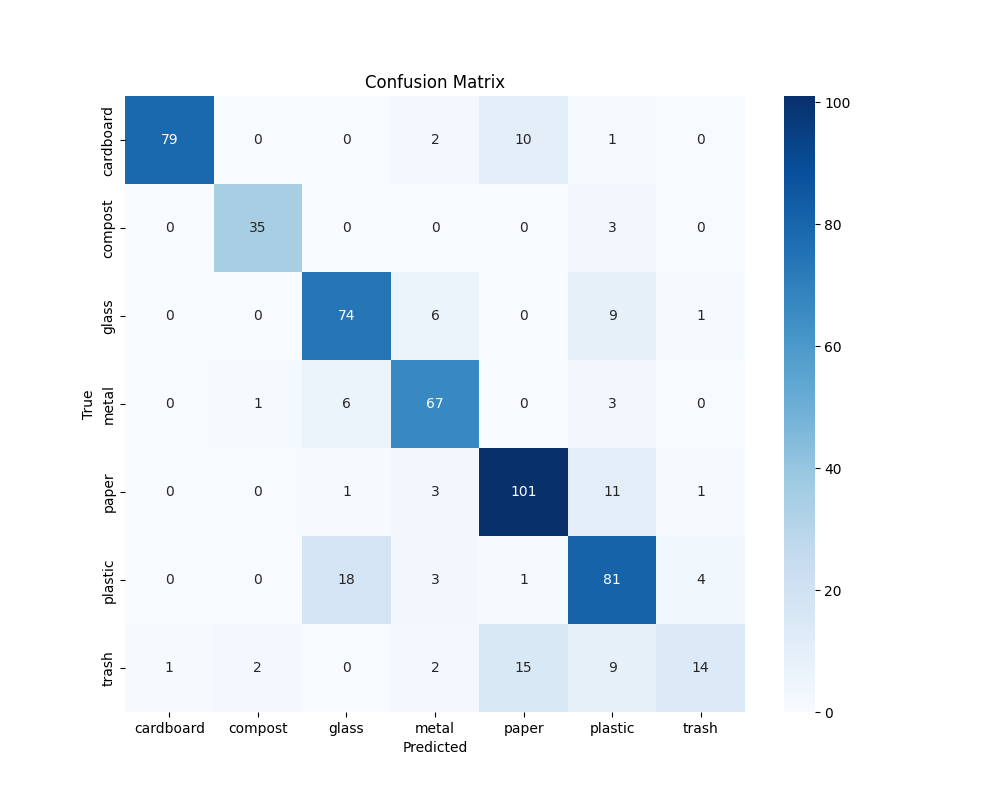
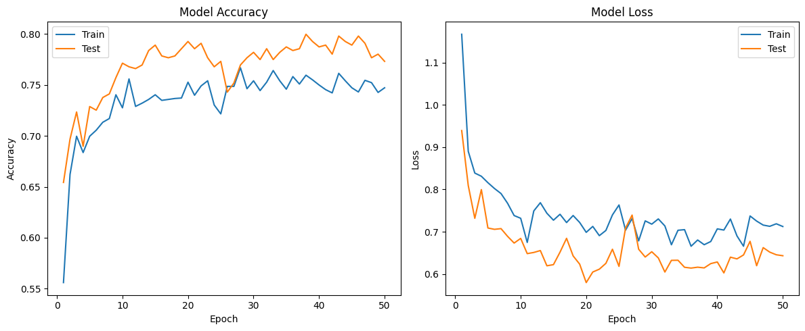
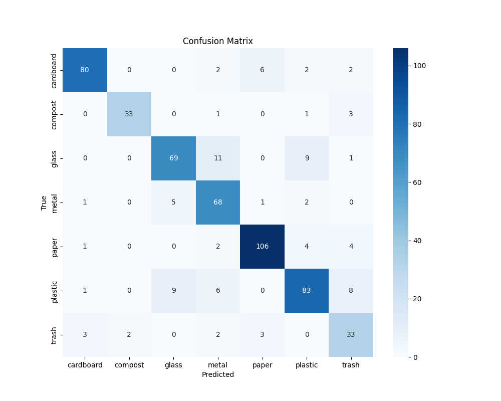
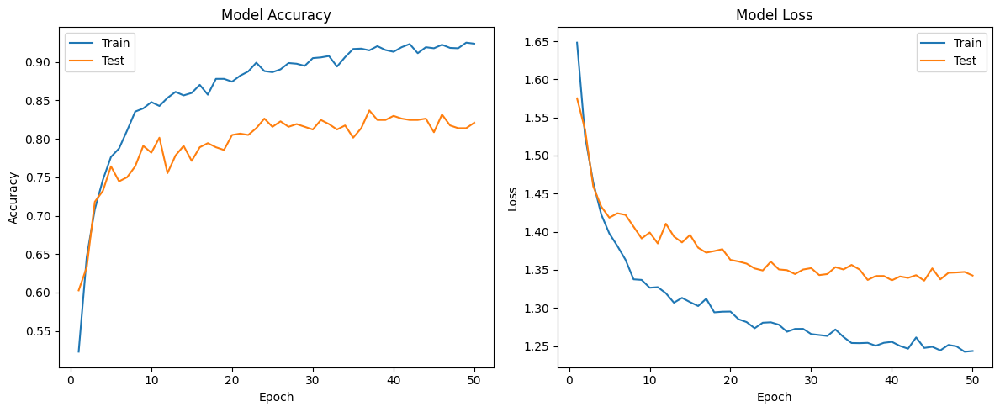

# Deep_Learning

Welcome to my PyTorch learning journey! This repository serves as a comprehensive resource for anyone looking to dive into PyTorch, from fundamentals to advanced topics. Each section is filled with thoroughly commented code examples and practical exercises to reinforce learning.

## Contents

1. **PyTorch Fundamentals**
   - Basic tensor operations
   - Autograd mechanics
   - Neural network building blocks

2. **PyTorch Workflows**
   - Data loading and preprocessing
   - Model creation and training loops
   - Evaluation and inference

3. **PyTorch Classification**
   - Binary and multi-class classification
   - Performance metrics and model evaluation
   - Transfer learning techniques

4. **PyTorch Computer Vision**
   - Convolutional Neural Networks (CNNs)
   - Image preprocessing and augmentation
   - Popular architectures (ResNet, VGG, etc.)

5. **PyTorch Custom Datasets**
   - Creating custom Dataset classes
   - Data loading and batching strategies
   - Working with various data formats

## Sorta-Bin Project: Waste Classification Project

   - Transfer Learning and Fine Tuning with VGG16
   - Multi-class classification of 7 types of waste and recyclables
   - Performance comparison between: 
         1. Transfer Learning
         2. Fine Tuning

### Results

#### Transfer Learning

#### Fine Tuning

Our experiments show that Fine Tuning slightly outperforms Transfer Learning, demonstrating the benefits of adapting pre-trained weights to our specific task.

For more details on the Sorta-Bin project, please refer to our [project documentation](Assets/Sorta-Bin%20Product%20Details.pdf).

## Structure

Each section contains:
- Jupyter notebooks with extensively commented code
- Practical exercises to apply learned concepts
- Solutions to exercises (in separate notebooks)

## Learning Approach

This repository follows the "learn by doing" philosophy. Each concept is introduced with clear explanations in the code comments, followed by hands-on implementation. The exercises are designed to challenge and reinforce your understanding.

## Resources

For a structured learning path and additional resources, I follow this guide:
[Insert your learning resource link here]

## Getting Started

1. Clone this repository
2. Install the required dependencies (listed in `requirements.txt`)
3. Start with the "PyTorch Fundamentals" section and progress through each topic
4. Complete the exercises in each section before moving to the next

## Contributions

While this is a personal learning repository, suggestions and improvements are welcome! Feel free to open an issue or submit a pull request.

## License

This project is open-sourced under the MIT license.

Happy learning!